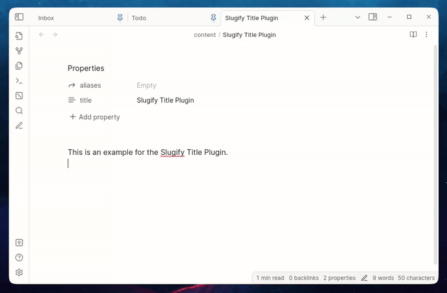

# Obsidian Slugify Title Plugin

Slugifies the current note's title (read's the frontmatter title), and adds it to the frontmatter aliases property. This plugin was generated using ChatGPT.

## Installation

1. Extract the latest release into your <vault-directory>/.obsidian/plugins directory.
1. Enable the plugin from the Obsidian settings menu.

## Usage

1. Run the "Add Slugified Title into Aliases" command.

